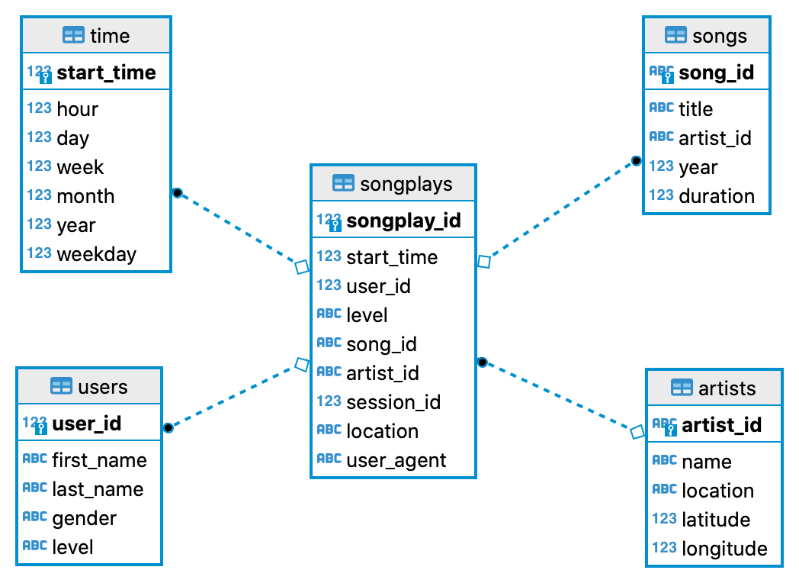

# Project: Data Modeling with Postgres

### Project Motivation
This is the first project of the Udacity Data Engineering Nanodegree. The task motivation was described as follows:

A startup called Sparkify wants to analyze the data they've been collecting on songs and user activity on their new music streaming app. The analytics team is particularly interested in understanding what songs users are listening to. Currently, they don't have an easy way to query their data, which resides in a directory of JSON logs on user activity on the app, as well as a directory with JSON metadata on the songs in their app.

They'd like a data engineer to create a Postgres database with tables designed to optimize queries on song play analysis, and bring you on the project. Your role is to create a database schema and ETL pipeline for this analysis. You'll be able to test your database and ETL pipeline by running queries given to you by the analytics team from Sparkify and compare your results with their expected results.

### Installation
- Install a recent version of python anaconda distribution. Use python3.
- Additionally install the following 3rd party libraries: pandas and psycopg2
- Clone this repository and follow instructions below
- The PostgreSQL database should be running on your local machine, e.g. dockerized

### Data and Database schema
This describes the data and the database schema
#### Data
The data contains of two datasets: one song dataset and one log dataset each consisting of multiple json files.

##### Song Dataset
The song data set is a subset of the real data from the Million Song Dataset. Each file is in json fomat and contains metadata about a song and the artist. An example of a single file looks as follows

```
{"num_songs": 1, "artist_id": "ARD7TVE1187B99BFB1", "artist_latitude": null, "artist_longitude": null, "artist_location": "California - LA", "artist_name": "Casual", "song_id": "SOMZWCG12A8C13C480", "title": "I Didn't Mean To", "duration": 218.93179, "year": 0}
```

##### Log Dataset
The log data set is generated by a simulator based on the song data set. Each files is in json format. An example of a single log entry looks as follows:

```
{"artist":"Death Cab for Cutie","auth":"Logged In","firstName":"Stefany","gender":"F","itemInSession":1,"lastName":"White","length":216.42404,"level":"free","location":"Lubbock, TX","method":"PUT","page":"NextSong","registration":1540708070796.0,"sessionId":82,"song":"A Lack Of Color (Album Version)","status":200,"ts":1541122241796,"userAgent":"\"Mozilla\/5.0 (Macintosh; Intel Mac OS X 10_9_4) AppleWebKit\/537.36 (KHTML, like Gecko) Chrome\/36.0.1985.143 Safari\/537.36\"","userId":"83"}
```

#### Database schema
Using the song and log datasets,  a star schema is created and optimized for queries on song play analysis. The schema looks as follows:



### File Description

* LICENSE: the license
* README.md: the readme file
- *create_tables.py*: drops and creates the tables
- data:
  - **song_data**: subset of real data from the Million Song Dataset
  - **log_data**: log files generated by simulatior based on the song_data
- *etl.ipynb*: prototyping notebook with which `etl.py` was implemented
- *etl.py*: extract, transform, and loads data from `song_data` or `log_data` into the tables
- *sql_queries.py*: definition of all sql queries
- *test.ipynb*: validation script of databases

### Instructions
1. Run the following command to create the database and tables: `python create_tables.py`
2. Run the following command to extract, transform and load the log_data and the song_data: `python etl.py`
3. Run `test.ipynb` to validate the tables with sample queries

### Licensing, Authors, Acknowledgements
Feel free to use the code here as you like.
